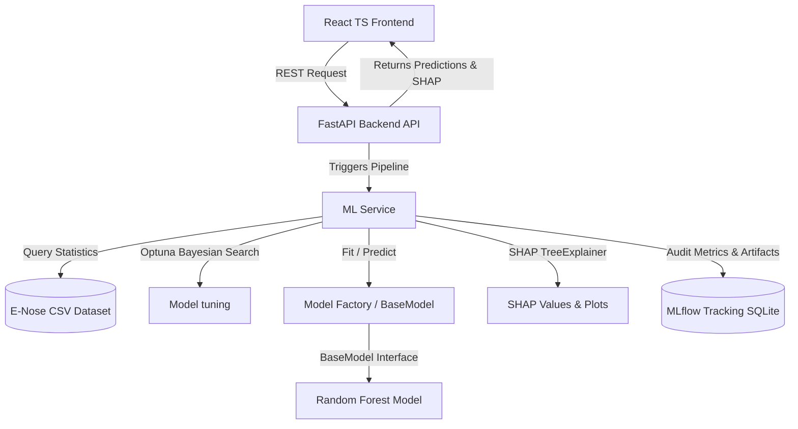

<<<<<<< HEAD
# E-Nose Non-Invasive Diabetes Detection AI Research Platform

A production-grade, modular, and extensible AI research platform utilizing Electronic Nose (E-Nose) metal oxide semiconductor (MOS) sensor array telemetry to classify and interpret patient diabetes risk.

---

## 🏛️ Platform Architecture

The system utilizes a decoupled MVC/service-oriented layout, orchestrating a FastAPI backend (Python) and a React dashboard (TypeScript/TailwindCSS).



---

## 🌟 Key Features

1. **Optuna Bayesian Optimization**: Automates tuning for Random Forest parameters (`n_estimators`, `max_depth`, `min_samples_split`, `min_samples_leaf`), logging F1 optimization history back to the UI.
2. **Explainable AI (SHAP)**: Computes additive feature attributions. Generates global beeswarm summary plots and local waterfall charts explaining specific patient diagnoses.
3. **MLflow Run Audit**: SQLite-backed tracker logs parameters, metrics (Accuracy, Precision, F1, ROC-AUC), and visual assets (confusion matrices, curves) per training run.
4. **BaseModel Factory**: Modular class architecture supporting painless swap-ins of future classifiers (XGBoost, CNNs) via edit of a single factory file.

---

## 🛠️ Quick Setup Guide

### Option A: Run via Docker Compose (Recommended)
This runs both the backend and frontend in containerized environments with hot-reloading mapped volumes.

1. Ensure [Docker](https://www.docker.com/) and Docker Compose are installed.
2. Launch the services:
   ```bash
   docker-compose up --build
   ```
3. Open your browser:
   - **Frontend**: [http://localhost:3000](http://localhost:3000)
   - **FastAPI OpenAPI Documentation**: [http://localhost:8000/docs](http://localhost:8000/docs)

---

### Option B: Local Manual Running

#### 1. Backend Setup
1. Navigate to backend:
   ```bash
   cd backend
   ```
2. Create and activate a Python virtual environment:
   ```bash
   python -m venv venv
   # Windows PowerShell
   .\venv\Scripts\Activate.ps1
   ```
3. Install dependencies:
   ```bash
   pip install -r requirements.txt
   ```
4. Run server:
   ```bash
   uvicorn app.main:app --reload --port 8000
   ```

#### 2. Frontend Setup
1. Navigate to frontend:
   ```bash
   cd ../frontend
   ```
2. Install npm packages:
   ```bash
   npm install
   ```
3. Launch development server:
   ```bash
   npm run dev
   ```
4. Open the displayed dev server link (usually `http://localhost:5173`).

---

## 📡 API Reference Documentation

### 1. Dataset Statistics
- **Endpoint**: `GET /api/dataset/stats`
- **Description**: Returns general metrics, class balances, and correlation heatmaps.

### 2. Model Training
- **Endpoint**: `POST /api/train`
- **Body Schema**:
  ```json
  {
    "run_tuning": true,
    "n_trials": 15
  }
  ```
- **Description**: Conducts Optuna tuning, fits the Random Forest model, logs files to MLflow, and returns metrics with base64 plots.

### 3. Patient Prediction
- **Endpoint**: `POST /api/predict`
- **Body Schema**:
  ```json
  {
    "TGS2600": 23.65,
    "TGS2602": 58.33,
    "TGS2610": 15.02,
    "TGS2611": 10.16,
    "TGS2620": 24.50,
    "TGS826": 30.04
  }
  ```
- **Description**: Predicts diabetes state, outputs confidence probability, and generates local SHAP waterfall values.

### 4. MLflow Logs
- **Endpoint**: `GET /api/experiments`
- **Description**: Fetches logs of all historic model training runs from the SQLite database.

---

## 📂 Project Structure
```text
├── backend/
│   ├── app/
│   │   ├── models/           # BaseModel interface, RF wrapper, factory
│   │   ├── services/         # Data preprocessing, SHAP, Optuna pipeline
│   │   └── main.py           # FastAPI application endpoints
│   ├── requirements.txt      # Python library spec
│   └── Dockerfile            # Container build spec
├── frontend/
│   ├── src/
│   │   ├── components/       # Layout structures
│   │   ├── pages/            # Home, Dataset, Train, Predict, Explain
│   │   ├── services/         # API fetch layer client
│   │   └── main.tsx & App.tsx
│   ├── package.json          # Node dependencies spec
│   └── Dockerfile            # Web staging server spec
├── docs/
│   ├── library_documentation.md  # Deep dive into libraries
│   └── model_integration_guide.md # Instructions for integrating XGBoost/CNNs
└── docker-compose.yml        # Multi-container conductor
```

---

## 📖 Research References & Guides
- Detailed Library Explanations: Check out the [Library Documentation](file:///c:/Users/spand/college/research_ml_E-nose/diabetes/Diabetes_frontend_ui/docs/library_documentation.md).
- Swapping and Swapping in New Models: Check out the [Model Integration Guide](file:///c:/Users/spand/college/research_ml_E-nose/diabetes/Diabetes_frontend_ui/docs/model_integration_guide.md).
=======
# E-Nose Diabetes AI Platform

An AI-powered healthcare platform for non-invasive diabetes risk screening using E-Nose breath sensor data.

## Features

- Diabetes Risk Prediction
- Random Forest Classification
- SHAP Explainability
- Clinical Recommendation Engine
- PDF Diagnostic Reports
- MVC Backend Architecture
- FastAPI REST APIs
- React + TypeScript Frontend
- Docker Deployment
- Research Analytics Dashboard

## Tech Stack

### Backend
- Python
- FastAPI
- Scikit-Learn
- SHAP
- ReportLab

### Frontend
- React
- TypeScript
- TailwindCSS

### Deployment
- Docker
- Docker Compose

## Models Evaluated

- Random Forest
- Logistic Regression
- XGBoost
- SVM
- KNN

## System Workflow

Patient Information
→ E-Nose Sensor Data
→ ML Prediction
→ Risk Assessment
→ Clinical Recommendation
→ PDF Report

## Project Structure

backend/
frontend/
docs/
reports/
trained_models/

## Future Scope

- Real E-Nose Device Integration
- Multi-Disease Detection
- Mobile Application
- Cloud Deployment
- Doctor Dashboard
>>>>>>> d6cee2fb3dcd26eefd3af67bf091313d8187133a
